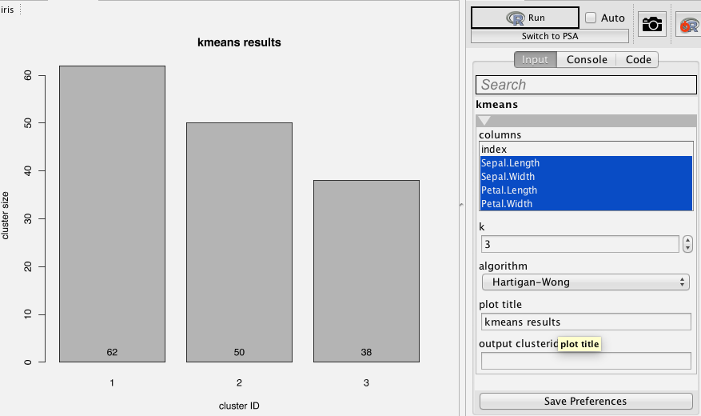
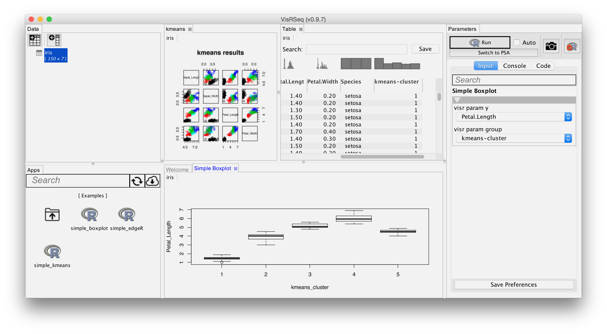
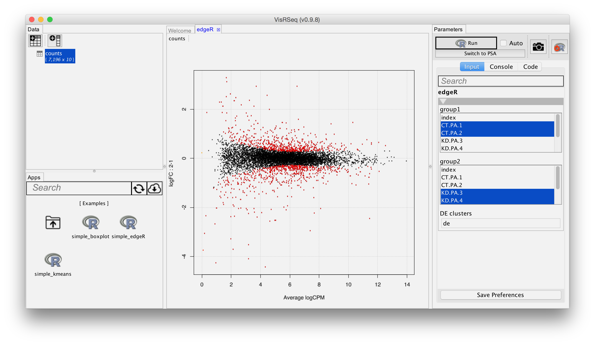

# Making R packages accessible to non-programmers using the VisRseq framework

This repository contains the course materials for the [Bioconductor 2016 workshop](http://bioconductor.org/help/course-materials/2016/BioC2016/).

A printer friendly PDF version of this can be downloaded here: [[PDF](vignettes/bioc2016.visrseq.pdf)]

## Abstract
The goal of this workshop is to introduce the [VisRseq](http://visrseq.github.io) framework and walk through the quick process of creating modules called R-apps from R packages. This is specifically useful for bioinformaticians and developers that would like to make their R packages accessible to their non-programmer collaborators or to the public without having to spend significant time on creating extensive graphical user interfaces. 

I will walk the participants through several examples of creating diverse types of apps, from simple plotting (e.g. ggplot) to intermediate (e.g. clustering) to more advanced (e.g. edgeR and DEseq) packages. I will also show how several R-apps can be linked together to create more complex workflows. 

## Requirements
Participants will require having beginner/intermediate knowledge of R and a machine with R and Java installation.
[[Installation Guide](http://visrseq.github.io/downloads/)]

### Full installation of workshop package
```{r, eval=FALSE}
# load bioc (if not already)
source("https://bioconductor.org/biocLite.R")
biocLite()

# build the package and vignettes
library(devtools)
biocLite("hyounesy/bioc2016.visrseq", build_vignettes = T)
library(bioc2016.visrseq)

#open source of this vignette in R studio
file.edit(system.file("doc","bioc2016.visrseq.Rmd", package="bioc2016.visrseq"))
```

To get the most out of this workshop you are recommended to install the latest version of VisRseq from [visrseq.github.io/downloads](http://visrseq.github.io/downloads).
You can still follow the instructions and create R-apps using plain R, however you will require VisRseq to be able to run the apps and see the results.

### Structure of an R-App


To create an R app you need a ```.R``` code containing the main script together with a ```.json``` file specifying parameters.
Each R app can have any number of "parameters", grouped into "categories".
The ```.json``` file can be created manually or using the helper function in ```visrutils.R```
```{r}
source("https://raw.githubusercontent.com/hyounesy/visr-apps/master/visrutils.R")
```

which defines the following functions among other things.

```{r eval=FALSE}
visr.app.start(name, info = "", debugdata = NULL)
visr.category(label, info = "")
visr.app.end(printjson = FALSE, writefile = FALSE, filename = NULL)
visr.param (name, label = NULL, info = NULL,
            default = NULL, min = NULL, max = NULL,
            items = NULL, item.labels = NULL,
            type = c("string", "character", "int", "integer",
                     "double", "boolean", "logical", "multi-string",
                     "column", "multi-column",
                     "column-numerical", "multi-column-numerical",
                     "color", "multi-color", "filename",
                     "output-column", "output-multi-column", "output-table"),
            filename.mode = c("load", "save", "dir"), debugvalue = NULL)
```

Let's get started and create our first app!

### Example 1: Boxplot

Let's start simple by creating a basic app that draws a barplot. Let's first write a basic boxplot script in a file ```simple_boxplot.R```:
```{r}
boxplot(mtcars[["mpg"]]~mtcars[["cyl"]], xlab = "cyl", ylab = "mpg")
```

Assume we would like to allow user to use their own data set and be able to specify x and y columns from their data.

We start the app definition by calling ```visr.app.start``` and specifying the app name. If we want be able to debug this app in R, we pass a test data set to ```debugdata```. This parameter will be ignored when running the app in VisRseq.
The data assigned to an app will be stored in ```visr.input``` variable.

```{r}
visr.app.start("Simple Boxplot", debugdata=mtcars)
```


We then add two parameters: ```y``` the numeric vector of data values that will be split into groups according to the parameter ```group```.
The parameter ```y``` has to be a numerical column in the input data, so we specify the ```type="column-numerical"```. The parameter ```group``` can be any column, so we specify ```type="column"```. In order to be able the debug the app inside the R, we also specify the values using ```debugvalue```. This is optional but recommended.

```{r}
visr.param("y", type="column-numerical", debugvalue="mpg")
visr.param("group", type="column", debugvalue="cyl")
```

This will create two parameters ```visr.param.y``` and ```visr.param.group```. When running the script in R, they will be initialized with their corresponding debugvalue column names. When running the app in VisRseq, they will contain the string name of the column selected in the GUI.

We end the definition by calling ```visr.app.end```. If argument ```printjson == TRUE```, the json data for the app parameters will be printed to console. If argument ```writefile == TRUE```, the output ```.json``` file will be written to a file specified by ```filename``` argument. If ```filename``` is not specified, the json file will be created at the same path of the R script, and same name but ```.json``` extension (i.e. ```simple_boxplot.json```).

```{r}
visr.app.end(printjson=TRUE, writefile = FALSE, filename = NULL)
```

We now have the json file. So we just have to modify our original R script to use the correct parameter names.

```{r eval=FALSE}
visr.applyParameters()

boxplot(visr.input[[visr.param.y]]~visr.input[[visr.param.group]],
        xlab = visr.param.group, ylab = visr.param.y)
```

Done! now if we place the ```simple_boxplot.R``` and ```simple_boxplot.json``` inside ```VisRseq/visr/srcR/bioc2016``` and hit the ```Refresh``` icon above the apps pane, we will have our first custom app in VisRseq under the ```bioc2016``` folder.
For demonstration, here we have used the app to draw a boxplot for the iris dataset.


Below is the complete source code for ```simple_boxplot.R``` app:

```{r eval=FALSE}
source("visrutils.R")
# parameters
visr.app.start("Simple Boxplot", debugdata=mtcars)
visr.param("y", type="column-numerical", debugvalue="mpg")
visr.param("group", type="column", debugvalue="cyl")
visr.app.end(printjson=TRUE, writefile = FALSE, filename = NULL)
visr.applyParameters()

# code
boxplot(visr.input[[visr.param.y]]~visr.input[[visr.param.group]],
        xlab = visr.param.group,
        ylab = visr.param.y)
```


### Exercise: Violin Plot
Let's do an exercise and create another app to draw violin plots.


### Example 2: Kmeans

We will now make something more interesting: A kmeans clustering app.
Like the previous example, we will start with the R script for kmeans clustering.

```{r}
input <- iris
columns <- c("Sepal.Length", "Sepal.Width", "Petal.Length", "Petal.Width")
cluster_data<-subset(input, select = columns)
clusterid <- kmeans(cluster_data, centers = 3)$cluster
plot(cluster_data, col = as.integer(clusterid))
```


```{r}
# start parameter definition
visr.app.start("Simple Kmeans", debugdata = iris)
visr.category("clustering parameters")
visr.param("columns", type = "multi-column-numerical",
           debugvalue = c("Sepal.Length", "Sepal.Width", "Petal.Length", "Petal.Width"))
visr.param("k", default = 3)
visr.param("algorithm", items = c("Hartigan-Wong", "Lloyd", "Forgy", "MacQueen"))
visr.category("output")
visr.param("plot.title", default = "kmeans results")
visr.param("output.clusterid", type = "output-column")
visr.app.end(printjson=TRUE)

```
```{r eval=FALSE}
visr.applyParameters()

cluster_data<-subset(visr.input, select = visr.param.columns)
visr.param.output.clusterid <- kmeans(cluster_data,
                                      centers = visr.param.k,
                                      algorithm = visr.param.algorithm)$cluster
plot(cluster_data, main = visr.param.plot.title,
     col = as.integer(visr.param.output.clusterid))
```



Below is the complete source code for ```simple_kmeans.R``` app:
```{r eval=FALSE}
source("visrutils.R")

#  parameters
visr.app.start("Simple Kmeans", debugdata = iris)
visr.category("clustering parameters")
visr.param("columns", type = "multi-column-numerical",
           debugvalue = c("Sepal.Length", "Sepal.Width", "Petal.Length", "Petal.Width"))
visr.param("k", default = 3)
visr.param("algorithm", items = c("Hartigan-Wong", "Lloyd", "Forgy", "MacQueen"))
visr.category("output")
visr.param("plot.title", default = "kmeans results")
visr.param("output.clusterid", type = "output-column")
visr.app.end(printjson=TRUE)
visr.applyParameters()

# kmeans code
cluster_data<-subset(visr.input, select = visr.param.columns)
visr.param.output.clusterid <- kmeans(cluster_data,
                                      centers = visr.param.k,
                                      algorithm = visr.param.algorithm)$cluster
plot(cluster_data, main = visr.param.plot.title,
     col = as.integer(visr.param.output.clusterid))
```


#### Chaining apps
When running kmeans inside VisRseq on a test data, the result of the clustering will be stored in a new column specified by output cluster id.
We can preview this new column in a table view app, or even better we can now use that with the boxplot app we created earlier.



### Example 3: Differntial expression analysis using edgeR
```{r}
library("edgeR", quietly=T)
countdata = read.table(
  "https://raw.githubusercontent.com/hyounesy/bioc2016.visrseq/master/data/counts.txt",
  header=T, row.names = 1)
x <- countdata
head(x)
group1 <- c("CT.PA.1", "CT.PA.2")
group2 <- c("KD.PA.3", "KD.PA.4")
groups <- factor(c(rep(1, length(group1)), rep(2, length(group2)))) # c(1, 1, 2, 2)
# create edgeR's container for RNA-seq count data
y <- DGEList(counts=x[, c(group1, group2)], group = groups)
# estimate normalization factors
y <- calcNormFactors(y)
# estimate tagwise dispersion (simple design)
y <- estimateCommonDisp(y)
y <- estimateTagwiseDisp(y)
# test for differential expression using classic edgeR approach
et <- exactTest(y)
# total number of DE genes in each direction
is.de <- decideTestsDGE(et, adjust.method = "BH", p.value = 0.05, lfc = 0)
# The log-fold change for each gene is plotted against the average abundance
plotSmear(y, de.tags=rownames(y)[is.de!=0])
```


```{r}
## edgeR parameters
visr.app.start("edgeR", debugdata = countdata)
visr.param("group1", type = "multi-column-numerical", debugvalue = c("CT.PA.1", "CT.PA.2"))
visr.param("group2", type = "multi-column-numerical", debugvalue = c("KD.PA.3", "KD.PA.4"))
visr.param("output.de", label = "DE clusters", type = "output-column")
visr.app.end(printjson=TRUE, writefile=T)
visr.applyParameters()
```

```{r eval=FALSE}
## edgeR code
library("edgeR")
x <- visr.input
groups <- factor(c(rep(1, length(visr.param.group1)),  # e.g. 1,1
                   rep(2, length(visr.param.group2)))) # e.g. 2,2
# create edgeR's container for RNA-seq count data
y <- DGEList(counts=x[, c(visr.param.group1, visr.param.group2)], group = groups)
# estimate normalization factors
y <- calcNormFactors(y)
# estimate tagwise dispersion (simple design)
y <- estimateCommonDisp(y)
y <- estimateTagwiseDisp(y)
# test for differential expression using classic edgeR approach
et <- exactTest(y)
# total number of DE genes in each direction
is.de <- decideTestsDGE(et, adjust.method = "BH", p.value = 0.05, lfc = 0)
# export the results to VisRseq
visr.param.output.de <- as.factor(is.de)
# The log-fold change for each gene is plotted against the average abundance
plotSmear(y, de.tags = rownames(y)[is.de != 0])
```



Below is the complete source code for ```simple_edgeR.R``` app:

```{r eval=FALSE}
source("visrutils.R")

## edgeR parameters
visr.app.start("edgeR", debugdata = countdata)
visr.param("group1", type = "multi-column-numerical", debugvalue = c("CT.PA.1", "CT.PA.2"))
visr.param("group2", type = "multi-column-numerical", debugvalue = c("KD.PA.3", "KD.PA.4"))
visr.param("output.de", label = "DE clusters", type = "output-column")
visr.app.end(printjson=TRUE, writefile=T)
visr.applyParameters()


## edgeR code
library("edgeR")
x <- visr.input
groups <- factor(c(rep(1, length(visr.param.group1)),  # e.g. 1,1
                   rep(2, length(visr.param.group2)))) # e.g. 2,2
# create edgeR's container for RNA-seq count data
y <- DGEList(counts=x[, c(visr.param.group1, visr.param.group2)], group = groups)
# estimate normalization factors
y <- calcNormFactors(y)
# estimate tagwise dispersion (simple design)
y <- estimateCommonDisp(y)
y <- estimateTagwiseDisp(y)
# test for differential expression using classic edgeR approach
et <- exactTest(y)
# total number of DE genes in each direction
is.de <- decideTestsDGE(et, adjust.method = "BH", p.value = 0.05, lfc = 0)
# export the results to VisRseq
visr.param.output.de <- as.factor(is.de)
# The log-fold change for each gene is plotted against the average abundance
plotSmear(y, de.tags = rownames(y)[is.de != 0])
```


