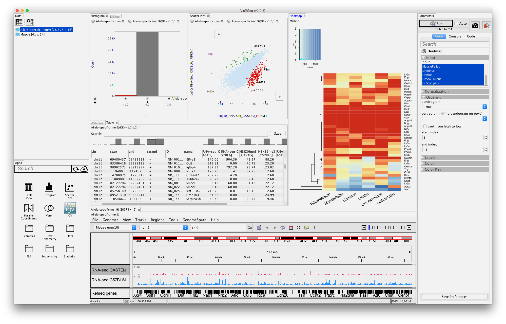
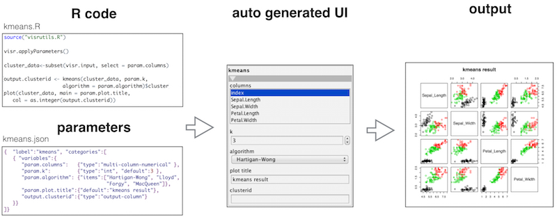

## Goals for this workshop

- Learn about VisRseq framework.

- Learn how to create custom apps.


### VisRseq Overview



### Structure of an R-App


## Let's get started!
```{r}
source("https://raw.githubusercontent.com/hyounesy/visr-apps/master/visrutils.R")
```

### Example 1: Kmeans
```{r}
# start parameter definition
visr.app.start("kmeans", debugdata = iris)
visr.category("clustering parameters")
visr.param("columns", type = "multi-column-numerical", debugvalue = c("Sepal.Length", "Sepal.Width"))
visr.param("k", default = 3)
visr.param("algorithm", items = c("Hartigan-Wong", "Lloyd", "Forgy", "MacQueen"))
visr.category("output")
visr.param("plot.type", items = c("scatter plot", "histogram"))
visr.param("plot.title", default = "kmeans results")
visr.param("output.clusterid", type = "output-column")
visr.app.end(printjson=TRUE)

visr.applyParameters()

cluster_data<-subset(visr.input, select = visr.param.columns)
visr.param.output.clusterid <- kmeans(cluster_data, visr.param.k, algorithm = visr.param.algorithm)$cluster

# plotting options
if (visr.param.plot.type == "scatter plot") {
    plot(cluster_data, main = visr.param.plot.title, col = as.integer(visr.param.output.clusterid))
} else {
  clustersTable <- table(visr.param.output.clusterid)
  lbls<-as.character(clustersTable)
  bplt<-barplot(clustersTable , xlab="cluster ID", ylab = "cluster size", main=visr.param.plot.title)
  text(y = 0, x = bplt, labels=lbls, xpd=TRUE, adj=c(0.5, -1))
}
```

### Example 2: Differntial expression analysis using edgeR
```{r}
library("edgeR", quietly=T)
countdata = read.table("https://raw.githubusercontent.com/hyounesy/bioc2016.visrseq/master/data/counts.txt", header=T, row.names = 1)
x <- countdata
head(x)
group1 <- c("CT.PA.1", "CT.PA.2")
group2 <- c("KD.PA.3", "KD.PA.4")
groups <- factor(c(rep(1, length(group1)), rep(2, length(group2)))) # c(1, 1, 2, 2)
# create edgeR's container for RNA-seq count data
y <- DGEList(counts=x[, c(group1, group2)], group = groups)
# estimate normalization factors
y <- calcNormFactors(y)
# estimate tagwise dispersion (simple design)
y <- estimateCommonDisp(y)
y <- estimateTagwiseDisp(y)
# test for differential expression using classic edgeR approach
et <- exactTest(y)
# total number of DE genes in each direction
is.de <- decideTestsDGE(et, adjust.method = "BH", p.value = 0.05, lfc = 0)
# The log-fold change for each gene is plotted against the average abundance
plotSmear(y, de.tags=rownames(y)[is.de!=0])
```


```{r}
## edgeR parameters
#countdata = read.table("https://raw.githubusercontent.com/hyounesy/bioc2016.visrseq/master/data/counts.txt", header=T, row.names = 1)
visr.app.start("edgeR", debugdata = countdata)
visr.param("group1", type = "multi-column-numerical", debugvalue = c("CT.PA.1", "CT.PA.2"))
visr.param("group2", type = "multi-column-numerical", debugvalue = c("KD.PA.3", "KD.PA.4"))
visr.param("output.de", label = "DE clusters", type = "output-column")
visr.app.end(printjson=TRUE, writefile=T)
visr.applyParameters()
```

```{r eval=FALSE}
## edgeR code
library("edgeR")
x <- visr.input
groups <- factor(c(rep(1, length(visr.param.group1)), rep(2, length(visr.param.group2)))) # c(1, 1, 2, 2)
# create edgeR's container for RNA-seq count data
y <- DGEList(counts=x[, c(visr.param.group1, visr.param.group2)], group = groups)
# estimate normalization factors
y <- calcNormFactors(y)
# estimate tagwise dispersion (simple design)
y <- estimateCommonDisp(y)
y <- estimateTagwiseDisp(y)
# test for differential expression using classic edgeR approach
et <- exactTest(y)
# total number of DE genes in each direction
is.de <- decideTestsDGE(et, adjust.method = "BH", p.value = 0.05, lfc = 0)
# export the results to VisRseq
visr.param.output.de <- as.factor(is.de)
# The log-fold change for each gene is plotted against the average abundance
plotSmear(y, de.tags = rownames(y)[is.de != 0])
```